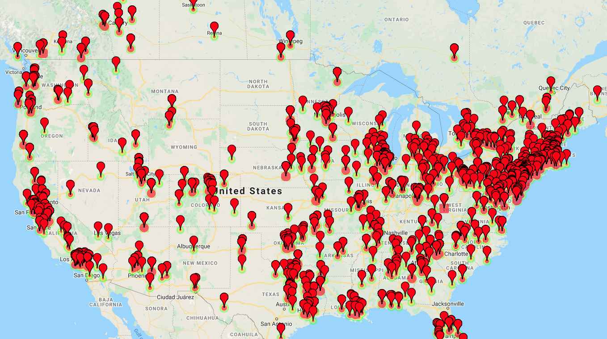

# Utilizing Twitter for Disaster Detection  

The goal of this project was to use Twitter to correctly identify natural disasters as they occur.

This project was developed by: 

Mathea Stevens, 
Noah Zuckerman, 
Maya Morales, and
Zachary Katsnelson

## Problem Statement  
Detection of disasters such as tsunamis, wildfires, or bombings rely on tradional methods such as early warning detection systems. Twitter is a popular social media platform with millions of active users interacting through it in real time. We will attempt to leverage this constant stream of data through the monitoring and identification of relevant tweets. Our goal is to correctly classify this data, as one of nine major disasters or a non-disaster in order to quickly and effectively detect disasters as they occur in real time.

## Executive Summary  

### Data:
Using a dataset of over 90,000 labeled disaster-related tweets, we trained a model using NLP to classify tweets by their respective disaster, or as a non-disaster.

Our dataset consisted of (in order of label, number of data points):
1. neutral       27826
2. hurricane     17332
3. floods        11773
4. earthquake     8745
5. tornado        6931
6. bombing        4879
7. wildfire       4263
8. explosion      4236
9. noreaster      2924
10. mudslide      2671

This data was taken from a variety of sources and then cleaned, preprocessed, and analyzed using exploratory data analysis.

### Modeling:

Our data was first passed into a Word2Vec model in the embedding layer. It was then passed into a Bidirectional LSTM of 128 nodes, which was regularized using L2. To assure that the bias-variance tradeoff would be as low as possible, this was passed into a second Dropout layer. The data was then passed into a Dense layer of 16 nodes, before being output in a softmax layer for classification. The model was compiled with categorical cross entropy and adam optimization.

### Mapping

## Conclusion
Our model was able to get 91% accuracy on both the train and test set. This represents a drastic improvement from our null hypothesis and baseline accuracy of 30%.

We can further implement our methods with new keywords and date-ranges in order to observe and detect different types of natural disasters, as well as further train our model to correctly classify these events.